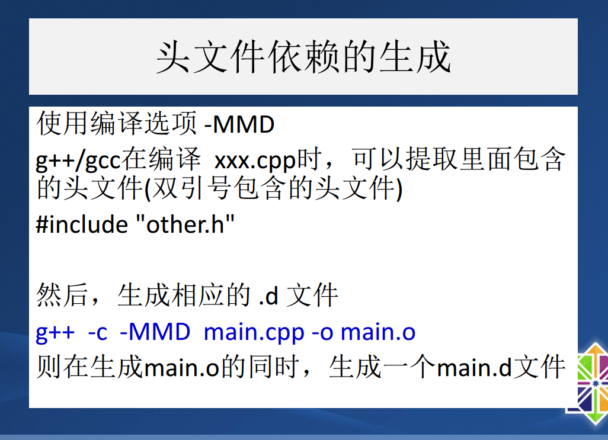
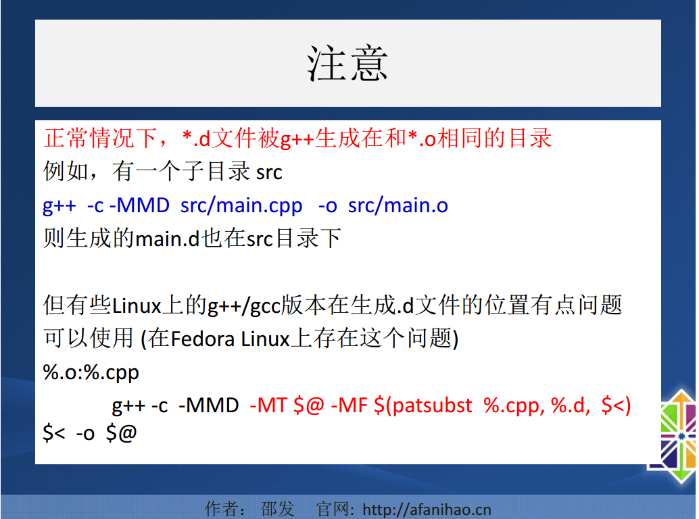

# Makefile

[TOC]

## 1.认识Makefile

## 2.增量编译

## 3.变量和函数

## 4.优化makefile

几个例子

建立一个测试目录，在测试目录下建立一个名为sub的子目录

~~~shell
$ mkdir test
$ cd test
$ mkdir sub
~~~

建立一个简单的Makefile

~~~makefile
src=$(wildcard *.c ./sub/*.c)
dir=$(notdir $(src))
obj=$(patsubst %.c,%.o,$(dir) )
all:
 @echo $(src)
 @echo $(dir)
 @echo $(obj)
 @echo "end"
~~~

输出结果

> 执行结果分析：
> 第一行输出：
> a.c b.c ./sub/sa.c ./sub/sb.c
>
> wildcard把 指定目录 ./ 和 ./sub/ 下的所有后缀是c的文件全部展开。
>
> 第二行输出：
> a.c b.c sa.c sb.c
> notdir把展开的文件去除掉路径信息
>
> 第三行输出：
> a.o b.o sa.o sb.o
>
> 在$(patsubst %.c,%.o,$(dir) )中，patsubst把$(dir)中的变量符合后缀是.c的全部替换成.o，
> 任何输出。

## 5.头文件依赖的自动生成

第一个版本的Makefile

~~~makefile
 
######### 标准Makefile Lv1.0 ########
EXE=helloworld
SUBDIR=src object
#CXX_SOURCES=$(wildcard  *.cpp)
CXX_SOURCES =$(foreach dir,$(SUBDIR), $(wildcard $(dir)/*.cpp))
CXX_OBJECTS=$(patsubst  %.cpp, %.o, $(CXX_SOURCES))
DEP_FILES  =$(patsubst  %.o,  %.d, $(CXX_OBJECTS))

$(EXE): $(CXX_OBJECTS)
	g++  $(CXX_OBJECTS) -o $(EXE)	
%.o: %.cpp
	g++  -c  -MMD $<  -o  $@
-include $(DEP_FILES)
clean: 
	rm  -rf  $(CXX_OBJECTS)  $(DEP_FILES)  $(EXE)
test:
	echo $(CXX_OBJECTS)
~~~

