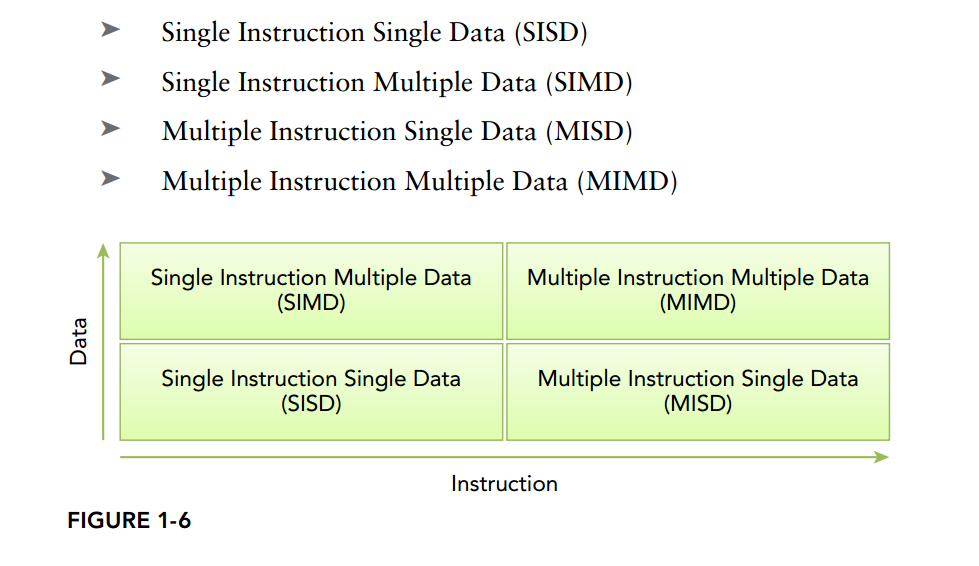

# cuda

[TOC]

## 1. Install

**recommend .run file**

Download CUDA Toolkit from: https://developer.nvidia.com/cuda-downloads. Select runfile(local) as the installer type. The downloaded file should be like cuda8.0.61375.26_linux.run.
Some libraries (including OpenGL, GLU, GLUT, X11) have to be installed to run CUDA samples:

```bash
sudo apt-get install freeglut3-dev build-essential libx11-dev libxmu-dev libxi-dev libgl1-mesa-glx libglu1-mesa libglu1-mesa-dev
```

Quit the X session by pressing ctrl+alt+(F1~F6). In command line mode:

```false
sudo service lightdm stop
```

Then go to the folder containing the .run file and type in:

```false
chmod +x cuda_8.0.61_375.26_linux.run
sudo ./cuda_8.0.61_375.26_linux.run
```

Here you are supposed to have installed the graphic driver already. Hit the Space until the end of the instructions. Then type in accept to contiunue. Note that DON'T install NVidia graphic driver again!

**Note**: It is recommended that first download the cuda driver from official web, then install. Not install dirver in this step!

The environment variables need to be changed so that your system can find CUDA's libraries and binaries:

```bash
sudo nano /etc/ld.so.conf
```

Append the following line in the .conf file:

```bash
/usr/local/cuda/lib64
```

Save with ctrl+O and Enter, then exit with ctrl+X. Reload the cache of the dynamic linker with:

```bash
sudo ldconfig
```

Now, append CUDA's bin directory to your PATH:

```bash
sudo nano ~/.bashrc
```

Append the following line at the end of the file:

```false
export PATH=$PATH:/usr/local/cuda/bin
```

CUDA is now installed and you can build CUDA samples and run the tests.

## 2. Config

1. compile in command line

   这是因为没有安装freeglut3-dev，安装：

   ~~~bash
   sudo apt-get install freeglut3-dev
   ~~~

   编译时需要链接这两个动态库

   ~~~bash
   nvcc julia_cpu.cu -o julia_cpu -lglut -lGL  
   ~~~

2. cmake

   - basic config

   ~~~cmake
   # CMakeLists.txt to build hellocuda.cu
   cmake_minimum_required(VERSION 2.8)
   find_package(CUDA QUIET REQUIRED)
   # Specify binary name and source file to build it from
   cuda_add_executable(hellocuda hellocuda.cu)
   ~~~

   注意：项目的名字不能和可执行文件的名字一样。

   more details, see: https://codeyarns.com/2013/09/13/how-to-build-cuda-programs-using-cmake/

   - glut and opengl

   ~~~cmake
   # CMakeLists.txt to build hellocuda.cu
   cmake_minimum_required(VERSION 2.8)
   project(hellocuda)
   find_package(CUDA QUIET REQUIRED)
   find_package(OpenGL REQUIRED)
   find_package(GLUT REQUIRED)
   include_directories( ${OPENGL_INCLUDE_DIRS}  ${GLUT_INCLUDE_DIRS} )
   # Specify binary name and source file to build it from
   cuda_add_executable(hellocuda hellocuda.cu)
   target_link_libraries(hellocuda ${OPENGL_LIBRARIES} ${GLUT_LIBRARY})
   ~~~

3. elipse

   - basic usage

     see official tutorial: http://docs.nvidia.com/cuda/nsight-eclipse-edition-getting-started-guide/index.html

   - library usage

     **include**

     General->Code Analysis->Paths and Symbols下进行加入：Includes下加入程序需要用到的头文件的路径

     **library**

     如果库没有加入到系统路径中，那么要在Library Path下添加需要用到库文件的路径。

     具体用到的库文件名称在Libraries选项卡加入，不需要加入.so后缀。

     静态库呢？

     **参考**

     Linux下CUDA集成开发环境－NSight Eclipse Edition：http://blog.csdn.net/wu070815/article/details/8243521

     ​

     ​

     ​


## 3. Examples

1. helloworld

   ~~~c
   #include <iostream>
   __global__ int kernel(){
   }

   int main(){
   	kernel<<<1,1>>>();
   	std::cout<<"Hello,world!"<<std::endl;
   	return 0;
   }
   ~~~

2. kernel中加参数

   ~~~c
   #include <iostream>
   __global__ void kernel(int a,int b,int *c){
       *c=a+b;//传递参数		
   }

   int main(){
           int c;//主机上的变量
   	int *dev_c;//设备上的指针
   	//设备上分配内存
   	cudaMalloc((void **) &dev_c, sizeof(int));
   	kernel<<<1,1>>>(2,7,dev_c);
   	cudaMemcpy(&c,dev_c,sizeof(int),cudaMemcpyDeviceToHost);
   	std::cout<<"2+7="<<c<<std::endl;
   	cudaFree(dev_c);
   	return 0;
   }
   ~~~

   **Note:**  如何理解CUDA中的cudaMalloc()的参数：http://blog.csdn.net/bruce_0712/article/details/73656087

3. 模拟cpu多线程

   ~~~c++
   #include <iostream>
   #define N 10
   void add_1(int *a,int *b,int *c){
   	int tid=0;
   	while(tid<N){
   		c[tid]=a[tid]+b[tid];
   		tid+=2;
   	}
   }
   void add_2(int *a,int *b,int *c){
       int tid=1;
       while(tid<N){
           c[tid]=a[tid]+b[tid];
           tid+=2;
       }
   }

   int main(){
   	int a[N],b[N],c[N];
   	for(int i=0;i<N;i++){
   		a[i]=i;
   		b[i]=i;
   	}
       //实际上把这个模拟成多线程就可以了。
   	add_1(a,b,c);
       add_2(a,b,c);
   	for(int i=0;i<N;i++){
   		std::cout<<"a[i]+b[i]="<<c[i]<<std::endl;
   	}
   	return 0;
   }
   ~~~

   ​

4. add_loop_gpu.cu

   ~~~c

   ~~~


## 4. 基于cuda的异构并行计算

首先，要明确的是异构的意思，其实说明了很简单啊，就是cpu和gpu一起合作。接下来开始详细讲解。

### 4.1 并行计算

并行运算涉及到两个方面的技术，包括计算机架构（硬件部分）和并行编程（软件部分）。这里就不展开了。


补充一个知识点：我们讲的cpu包括内存，中央处理单元和输入输出接口，如图。其中最重要的是CPU，也称为核（core）。可以分为单处理器（单核），也可以分为多处理器（多核）。


#### 4.1.1 串行编程和并行编程

程序分为两种类型：

- 串行，就是顺序执行
- 并行，就是同时执行


#### 4.1.2 并行性

以下主要介绍并行。并行又可以分为两种，任务并行和数据并行。

- 任务并行：许多任务或者函数独立地、大量地以平行方式运行。


- 数据并行：在同一个时间对大量的数据进行操作。数据并行将数据分布到不同的core中进行计算。


**cuda编程研究的是数据并行。**

**并行数据的划分**

将数据分给不同的线程，不同的线程处理数据的一部分。可以分为两种分法，一种是块分配，一种是周期分配。

- 块分配就是把数据分成多块，然后每个线程都处理一块内存。
- 周期分配正好不一样，每个块分配的数据更少，每个线程可以处理多个块。块的分配可以一维的，也可以是两维的。


#### 4.1.3 计算机架构

按照弗林分类法，可以分为四种：

1. 单指令（instruction）单数据：最传统的那种方式。是一种序列架构。在计算机中只有一个核，在任意时间都是执行一个指令流（instruction stream），并且只有一个数据流。
2. 单指令多数据：指的是并行架构的一种。在计算机中有多个核。所有的核都执行相同的指令。
3. 多指令单数据：对同一个数据流，采取不同的指令。
4. 多指令多数据：...



这些架构的目标都是为了：

1. 降低延迟（latency）：一个操作完成的时间。
2. 增加带宽（bandwidth)： 单位时间处理的数据量。
3. 增加吞吐量（throughput）：单位时间处理的操作数量。

计算机架构也可以**按照内存**分为以下两种：

1. 多节点的分布式内存：大规模的计算引擎是通过网络将各个处理器连接起来的。这种方式称为集群。
2. 多处理器的共享内存： 具有很多核，它们共享内存。自己的理解：比如cpu，可以采用八核，属于multicore。如果是gpu，那么是many-core，核是相当的多啊。


尽管许多核心和多核被用来标记GPU和CPU架构，但GPU内核与CPU核心完全不同。CPU核心，重量相对较重，是为非常复杂的控制逻辑而设计的，优化顺序程序执行。GPU核心，相对轻，是优化的数据并行任务与更简单的控制逻辑，专注于并行程序的吞吐量。


### 4.2异构计算

异构计算（HETEROGENEOUS COMPUTING）说白了，非常简单啊！就是CPU和GPU是两个独立的处理器，它们通过单个计算节点中的PCI-Express总线相连。

#### 4.2.1异构架构

A typical heterogeneous compute node nowadays consists of two multicore CPU sockets and two or more many-core GPUs. 

A heterogeneous application consists of two parts:
➤ Host code
➤ Device code


描述GPU性能的两个特征：

1. cuda 核的数量
2. 内存的大小

根据这个，有两个度量标准：

1. 峰值计算性能(peak computational performance)
2. 内存带宽

**峰值计算性能**是用来评估计算能力的一个指标，通常定义为每秒能处理的单精度或双精度浮点运算的数量。峰值性能通常用GFlops（每秒十亿次浮点运算）或TFlops（每秒万亿次浮点运算）来表示。**内存带宽**是从内存中读取或写入数据的比率。内存带宽通常用GB/s表示。表1-1所示为Fermi架构和Kepler架构的一些性能指标。


#### 4.2.2异构计算范例

介绍了这么多gpu的优点，并不是说gpu可以代替cpu，实际上gpu和cpu各有各的好处

> CPU computing is good for control-intensive tasks, and GPU computing is good for data-parallel computation-intensive tasks

如果一个问题有较小的数据规模、复杂的控制逻辑和/或很少的并行性，那么最好选择CPU处理该问题，因为它有处理复杂逻辑和指令级并行性的能力。相反，如果该问题包含较大规模的待处理数据并表现出大量的数据并行性，那么使用GPU是最好的选择。因为GPU中有大量可编程的核心，可以支持大规模多线程运算，而且相比CPU有较大的峰值带宽。


因为CPU和GPU的功能互补性导致了CPU＋GPU的异构并行计算架构的发展，这两种处理器的类型能使应用程序获得最佳的运行效果。因此，为获得最佳性能，你可以同时使用CPU和GPU来执行你的应用程序，在CPU上执行串行部分或任务并行部分，在GPU上执行数据密集型并行部分，如图所示。


## 5. Memory

  ### 5.1 CPU中内存和缓存模型

内存和缓存是有区别的。许多人认为，“缓存”是内存的一部分，许多技术文章都是这样教授的。但是还是有很多人不知道缓存在什么地方，缓存是做什么用的。其实，缓存是CPU的一部分，它存在于CPU中。CPU存取数据的速度非常的快，一秒钟能够存取、处理十亿条指令和数据（术语：CPU主频1G），而内存就慢很多，快的内存能够达到几十兆就不错了，可见两者的速度差异是多么的大。缓存是为了解决CPU速度和内存速度的速度差异问题。内存中被CPU访问最频繁的数据和指令被复制入CPU中的缓存，这样CPU就可以不经常到象“蜗牛”一样慢的内存中去取数据了，CPU只要到缓存中去取就行了，而缓存的速度要比内存快很多。

参考文章

缓存和内存的区别：http://blog.csdn.net/lansesl2008/article/details/70224079

### 5.2 CUDA存储器类型


- 每个线程拥有自己的register and loacal memory；

- 每个线程块拥有一块shared memory；

- 所有线程都可以访问global memory；

- 还有，可以被所有线程访问的只读存储器：constant memory and texture memory。


#### 5.2.1 寄存器Register

寄存器是GPU上的高速缓存器，其基本单元是寄存器文件，每个寄存器文件大小为32bit。Kernel中的局部(简单类型)变量第一选择是被分配到Register中。

特点：每个线程私有，速度快。

#### 5.2.2 局部存储器 local memory

当register耗尽时，数据将被存储到local memory。如果每个线程中使用了过多的寄存器，或声明了**大型结构体或数组**，或编译器无法确定数组大小，线程的私有数据就会被分配到local memory中。

特点：每个线程私有；没有缓存，慢。

注：在声明局部变量时，尽量使变量可以分配到register。如：

~~~c
unsigned int mt[3];
~~~

改为：　

~~~c
unsigned int mt0, mt1, mt2;
~~~

#### 5.2.3 共享存储器 shared memory

可以被同一block中的所有线程读写

特点：block中的线程共有；访问共享存储器几乎与register一样快.

```c++
//u(i)= u(i)^2 + u(i-1)  
//Static  
__global__ example(float* u) { 
    int i=threadIdx.x;  
    __shared__ int  tmp[4];  
    tmp[i]=u[i];  
    u[i]=tmp[i]*tmp[i]+tmp[3-i];  
}  

int main() {  
    float hostU[4] = {1, 2, 3, 4};  
    float* devU;  
    size_t size = sizeof(float)*4;  
    cudaMalloc(&devU, size);  
    cudaMemcpy(devU, hostU, size, cudaMemcpyHostToDevice);  
    example<<<1,4>>>(devU, devV);  
    cudaMemcpy(hostU, devU, size,  
    cudaMemcpyDeviceToHost);  
    cudaFree(devU);  
    return 0; 
}  

//Dynamic  

extern shared int tmp[];  
global example(float* u) {  
    int i=threadIdx.x;   
  	tmp[i]=u[i];   
  	u[i]=tmp[i]*tmp[i]+tmp[3-i];  
  }  

int main() {  
    float hostU[4] = {1, 2, 3, 4};  
    float* devU;  
    size_t size = sizeof(float)*4;  
    cudaMalloc(&devU, size);  
    cudaMemcpy(devU, hostU, size, cudaMemcpyHostToDevice);  
    example<<<1,4,size>>>(devU, devV);  
    cudaMemcpy(hostU, devU, size, cudaMemcpyDeviceToHost);  
    cudaFree(devU);  
    return 0;  
}  
```

#### 5.2.4 全局存储器 global memory

特点：所有线程都可以访问；没有缓存

~~~c++
//Dynamic  
__global__ add4f(float* u, float* v) {  
    int i=threadIdx.x;  
    u[i]+=v[i];  
}  
int main() {  
    float hostU[4] = {1, 2, 3, 4};  
    float hostV[4] = {1, 2, 3, 4};  
    float* devU, devV;  
    size_t size = sizeof(float)*4;  
    cudaMalloc(&devU, size);  
    cudaMalloc(&devV, size);  
    cudaMemcpy(devU, hostU, size,  
    cudaMemcpyHostToDevice);  
    cudaMemcpy(devV, hostV, size,  
    cudaMemcpyHostToDevice);  
    add4f<<<1,4>>>(devU, devV);  
    cudaMemcpy(hostU, devU, size,  
    cudaMemcpyDeviceToHost);  
    cudaFree(devV);  
    cudaFree(devU);  
    return 0;  
}  
  
//static  
__device__ float devU[4];  
__device__ float devV[4];  
  
__global__ addUV() {  
int i=threadIdx.x;  
 devU[i]+=devV[i];  
}  
  
int main() {  
    float hostU[4] = {1, 2, 3, 4};  
    float hostV[4] = {1, 2, 3, 4};  
    size_t size = sizeof(float)*4;  
    cudaMemcpyToSymbol(devU, hostU, size, 0, cudaMemcpyHostToDevice);  
    cudaMemcpyToSymbol(devV, hostV, size, 0, cudaMemcpyHostToDevice);  
     addUV<<<1,4>>>();  
    cudaMemcpyFromSymbol(hostU, devU, size, 0, cudaMemcpyDeviceToHost);  
    return 0;  
}  
~~~

#### 5.2.5 常数存储器 constant memory

用于存储访问频繁的只读参数                             

特点：只读；有缓存；空间小(64KB)

注：定义常数存储器时，需要将其定义在所有函数之外，作用于整个文件。

```c++
__constant__ int devVar;
cudaMemcpyToSymbol(devVar, hostVar, sizeof(int), 0, cudaMemcpyHostToDevice)
cudaMemcpyFromSymbol(hostVar, devVar, sizeof(int), 0, cudaMemcpyDeviceToHost)
```

参考文章:

 CUDA中的常量内存`__constant__`：http://blog.csdn.net/dcrmg/article/details/54895834

#### 5.2.6 纹理存储器 texture memory

是一种只读存储器，其中的数据以一维、二维或者三维数组的形式存储在显存中。在通用计算中，其适合实现图像处理和查找，对大量数据的随机访问和非对齐访问也有良好的加速效果。

特点：具有纹理缓存，只读。

**参考文章**

1. CUDA内存类型memory：http://blog.csdn.net/augusdi/article/details/12186939
2. CUDA并行存储模型：https://www.cnblogs.com/liangliangdetianxia/p/3991042.html


## 6. 如何合理分配线程

参考文章

1. CUDA线程分配：http://blog.csdn.net/songhongdan/article/details/50925000
2. CUDA总结：线程网络和线程分配：http://blog.csdn.net/Kelvin_Yan/article/details/53589411

## 7. cuda硬件

GPU的硬件结构，也不是具体的硬件结构，就是与CUDA相关的几个概念：thread，block，grid，warp，sp，sm。

**sp:** 最基本的处理单元，streaming processor  最后具体的指令和任务都是在sp上处理的。GPU进行并行计算，也就是很多个sp同时做处理

**sm:**多个sp加上其他的一些资源组成一个sm,  streaming multiprocessor. 其他资源也就是存储资源，共享内存，寄储器等。

**warp:**GPU执行程序时的调度单位，目前cuda的warp的大小为32，同在一个warp的线程，以不同数据资源执行相同的指令。

**grid、block、thread：**在利用cuda进行编程时，一个grid分为多个block，而一个block分为多个thread.其中任务划分到是否影响最后的执行效果。划分的依据是任务特性和GPU本身的硬件特性。

参考

【CUDA学习】GPU硬件结构：https://www.cnblogs.com/dwdxdy/p/3215158.html

## 8. References

***cuda by example*笔记**

1. http://blog.csdn.net/w09103419
2. CUDA学习笔记一（从入门到放弃）http://blog.csdn.net/langb2014/article/details/51348425

**julia知识**

1. http://www.matrix67.com/blog/archives/4570
2. http://www.matrix67.com/blog/archives/292


***光线跟踪***

光线跟踪(RayTracing)原理及c++实现：http://blog.csdn.net/wozhengtao/article/details/51137059

***CUDA学习资源整合***

http://blog.csdn.net/konghaocc/article/details/78514572

***一个写cuda的博客***

http://www.cnblogs.com/muchen/default.html?page=3
