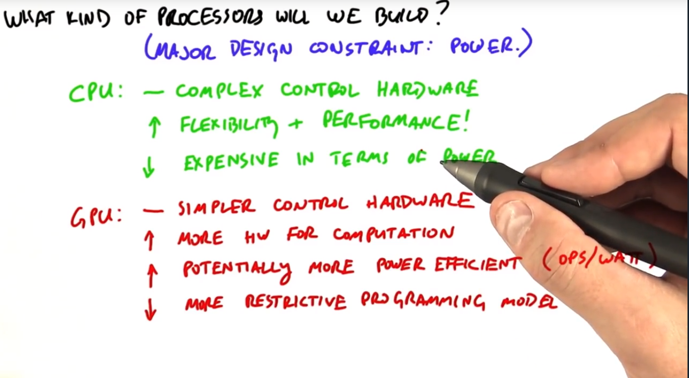
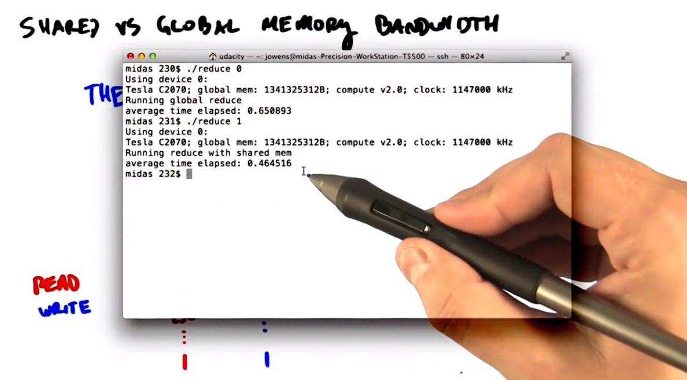

# Udacity cuda course note

Html version, please see:http://htmlpreview.github.io/?https://github.com/mensaochun/udacity-cuda-note/blob/master/README.html

[TOC]

## Lesson 1

### 1.挖洞的例子

​	早上好、下午好或晚上好，不管你你碰巧是什么时候。我是约翰，我将会介绍第一单元。让我们开始吧。

​	和很多美国孩子一样，在我大概 6 岁的时候，我试图挖个洞通往中国。我知道我不是唯一尝试过这么做的孩子。一般来说，你可能会得出结论美国孩子是a）有雄心的和b）不是特别擅长地理，至少在他们6岁的时候。不用说，我没有成功。为什么？除了注意力不集中，我只是不能足够快地挖洞。

​	我今天想提出的问题是：你如何才能更快地挖洞？我认为有 3 种方式可以让我进展更快。一、更快的速度挖。例如，不是每隔 2 秒铲除一铲子的泥土，而是，也许花费大量努力后，我可以每隔 1 秒铲除一铲子的泥土。这肯定有帮助，但我想我们都同意这个速度提升有一个限制。不管我如何努力工作，我也不可能以十倍的速度进行。我的铲子就可能会断裂。二、 买一把效率更高的铲子。让我们假设，一把铲子有两片或甚至三片刀刃，而不是只有一片。一个有趣的方法。也许更好的铁铲会让我更有效率。但同样，我想我们会同意制作更好铲子带来的效益也会递减。我不可能使用一把带有10或 20 片刀刃的铲子。三、雇用更多的挖掘者。我有一个妹妹和弟弟。也许我能够说服他们帮我挖得更快。这可能是针对我整个挖洞项目综合效率最高的方法。当然，增加挖掘者本身也产生问题。如何管理他们？他们会互相妨碍吗？更多挖掘者将帮我把洞挖得更深，而不是仅仅更宽？

​	嗯，你们可能已经明白我不仅仅是讨论挖洞。就建造更快处理器来说，这三个更快挖洞的方法都有一个并行。当我谈论更快挖掘时，其实我是讨论让我们的处理器以更快的时钟频率运行，在一次计算的每一步花费较短的时间。但是，在现代处理器中，提高时钟频率也会增加功耗，而我们受一块芯片上的功耗限制。当我谈论购买更有效率的铲子，其实我是说我们要求我们的处理器在每个步骤、每个时钟周期做更多的工作。但就像超级铁铲，单个处理器也已经出现在每个周期可做工作上的效益递减。更技术一点，就CPU在每个时钟周期能够提取多少指令级并行性而论，最先进的 CPU 处在极限。当谈到雇佣更多的挖掘者，在某种程度上我指的是并行计算，我们希望在这个课程教你们。我们不是雇用一名拥有神奇铁铲的挖掘者，而是雇用很多有铁铲的挖掘者。不是拥有一个或只是几个非常强大的处理器，我们要有很多很多较弱的、 不那么强大的处理器。

### 2.练习：如何让计算机跑得更快

​	问：第一个问题：硬件设计师让计算机运行速度更快的三种传统方式是哪些？请勾选正确的三项。我们的选项有更快的时钟、更长的时钟周期、每个时钟周期进行更多工作，更大的硬盘、增加更多处理器和减少内存数量。

​	答：三个正确答案是：更快的时钟——这相当于我们的更有效率的挖掘者；每个时钟周期进行更多工作——这相当于我们的超级铁铲；以及更多处理器——这相当于雇佣更多挖掘者。这是本课中我们将使用的方法。

### 3.鸡还是公牛

​	你或许已经观看过关于此课程的介绍了。在这里我要引用来自超级计算机之父西摩·克雷的一句话，如果你要耕地你会选择哪种方式？2头健壮的公牛或是1024只小鸡？我要说我会选择小鸡，而Dave也会选择小鸡。而且我希望在课程结束后你们也会选择小鸡。

​	现在要说的是本课程最重要的核心思想就是并行，我们能够通过将大的问题分解为小块以此解决它们，接着我们就能够同时运行这些小块。并行计算过去曾是小众化的利基技术被国外的超级计算机使用。现在世界都已步入并行时代，现代计算产品就像小鸡，它们拥有数百个处理器每个都能并行运行你问题的一小块。高端的图形处理器（GPU）包含超过3000个运算单元，运算器能够同时运行3000个算术运算。GPU能够使数以万计的并行块同时高效工作，我们调用这些块来处理线程一个现代GPU大概能运行多达65000的并发线程。所有这些计算能力加在一起足以帮助你以前所未有的速度解决问题了。但所有这些计算能力一起同时工作，并行的工作需要以一种不同于只为单一标量处理器编程的方式来实现。与你一次只做一件事是不同的，在本课程中我们会教大家如何对GPU编程让大家进行实际练习，我们把这称作GPU计算或GPGPU，意思是在图像处理单元上的通用编程。更重要的是我们将教大家如何并行的思维来编程，本课程布置的作业都将与图像处理应用程序有关。坦白讲，这些作业都非常酷，通过完成它们，大家将能够以极快的速度做出一些有趣的视觉效果。

### 4.CPU加速保持肥胖？

​	要想了解为什么现在图形处理器（GPU）是非常有趣的处理器，我们就得从技术趋势讲起。为什么并行在整个世界如此风靡？首先，我们先从一些好消息讲起。现代处理器是由晶体管制成的，这些晶体管逐年变小。这张图来自斯坦福的CPUDB项目组，感谢他们。图中显示了处理器特征尺寸随着时间的变化，这里的特征尺寸为芯片上晶体管或导线的最小尺寸。我们看到时间是按这个方向显示，这是以前，这是现在，这是特征尺寸即晶体管的大小。注意到晶体管每一代都在变小，当你听到在讨论45纳米处理器或22纳米，那就是我们指的特征尺寸。我们看到它随着时间不断地下降。随着特征尺寸的减小，晶体管变得更小，运行更快，能耗更低。而且我们能在芯片上集成更多晶体管。结论就是每年我们都会拥有更多的可供计算的资源。

​	但是，我们还是有些坏消息。历史上来说，由于晶体管的改进，处理器设计者能够增加处理器的时钟频率，使它们每年运行的越来越快。让我们看看这张时钟速度随年份的变化图。还是一样，我们的时间是在这根轴上，好吗，那么这是很久以前，这是现在。这里我们有时钟频率—即我们为这些晶体管计时的速度。从历史来看，时钟性能的主要驱动因素之一就是时钟速度提升。我们可以在许多年内，时钟速度一直在上升，但是，在近十几年，我们看到时钟速度却基本保持不变。

### 5.练习：CPU如何变得更快？

## Lesson 3

​	好吧，今天我们将进行第3讲，该讲课内容涉及基本的GPU算法。今天我们将讨论三种不同算法：归约（reduce）、扫描（scan）和直方图（histogram）。GPU计算以充分利用工作量的并发性为基础，就是说，那样的并发性在一种语言，例如CUDA语言中，允许在能利用很多同步计算的GPU上并行执行。现在，GPU很适合完全独立的通信模式，如映射运算。因此，在映射运算中，我们有很多计算元素。它们中的每一个都并行计算出它们的输出结果，而且是完全独立，没有任何通信的。

​	它在模板方面也很出色，或更一般地收集运算，就如我们在上一讲看到的。我们这里可能有一个项需要计算，我们打算到外面，从内存中取回几个项，然后做我们的计算。但下一项的计算又与第一个计算完全分开的。

​	然而，不是所有通信都属于这些范畴。它们中一些有更复杂的计算模式，如全部对一个或全部对多个的通信模式。例如，这边的这个元素依赖于这三个元素，这个元素的计算将依赖于这三个元素。而且注意到这里有一些重叠。所以，它更复杂一点。我们将讨论这些更复杂的计算模式以及在今天的讲课中能够运用的三个原语。这些原语是归约、扫描和直方图。这周的作业中也会用到它们。

### 1.Digging Holes Again

​	So let's go back to our dig a hole example. If we're going to dig a hole, we're really interested in 2 things. One is how long it's going to take to dig that hole, and 2, how much work, how many total hours it will take to dig.If you're the only one digging this hole, these 2 things are the same.So we have 1 worker, and perhaps it's going to take you 8 hours to finish,and so that means overall you're going to do 8 hours of work.But if you bring all your friends over to dig the hole with you,the amount of time to finish and the total amount of work might be different.So now we're going to have 4 workers,and perhaps they'll work together for 8 hours total and thus be able to finish in 2 hours.Thus they've finished digging this hole 4 times as fast. We'd actually call this ideal scaling since adding 4 times as many workers allowed us to finish 4 times as fast.Alternatively, we might have 4 diggers, each of which gets in each other's way,so we're not going to be quite as efficient.So, for instance, we might have 4 workers, and together it's going to take them 4 hours to finish,thus meaning that together they've done 16 hours of work.

​	Now you might reasonably ask yourself why your instructor spends so much time talking about digging holes, and that's a fair point.But there's a couple of important points of terminology that I want to make here.The first is the concept of a step.It's how long it takes to complete a particular computation--Operation Hole Digging.The second is the total amount of work that it took to perform that computation over all the active workers.And so we're going to go into a little more depth in terms of the way that we define these.

### 2.Step and Work

​	As we talk about algorithms, we're going to talk about 2 costs.The first is step complexity, and the second is work complexity.So as an example here we have 8 elements that we'd like to combine using this tree style structure.And so we're going to try to characterize the number of steps that it's going to take us to do this computation as well as the total amount of work.So first we're going to look at the number of steps.We see that it's going to take us 3 steps to finish.This first step here we'll do 4 operations,the second step can be done in parallel with 2 operations,and then the third step is a final operation to get a final result.But we can also count the total amount of work that we've done here. We've done 1, 2, 3, 4, 5, 6, 7 operations.So we'd say the step complexity is 3 and the work complexity is 7.

​	So we'll compare the step and work complexity of the parallel implementations that we develop against the step and work complexity for a serial implementation.And 1 more piece of terminology.We will say that a parallel algorithm is work-efficient.If it's work complexity, it's asymptotically the same,so within a constant factor as the work complexity of the sequential algorithm.Now if we can reduce the step complexity in our parallel implementation compared to the serial implementation while still having a reasonable work complexity that isn't too expensive,we expect that this will lead to faster runtime overall.So the real key here is to formulate the most efficient parallel algorithm,and that's the focus of this lecture and the next lecture.

​	Okay, so a quick quiz just to test a little understanding about number of steps and total amount of work.We have a more complicated tree right here,and so you can think of every circle here as 1 operation.Some operations take 2 inputs, some operations take 1.So what are the total number of steps in going from the inputs up here to the output down here?And what is the total amount of work measured in number of operations to get from the 8 inputs up here to the 1 output down here?

​	So to compute the number of steps, what we're going to do is start at the top and count how many steps it gets from the top to the bottom.So here's the first step. It has 8 operations.Second step, third step, fourth step, fifth step, sixth step,and then we've computed the final results.So we'd say there are 6 steps here.What's the total amount of work?Well, to do that, we count the number of operations.That's 8 + 4 + 4 + 2 + 2 + 1.That gives us 21 operations to compute the final answer here.When we discuss algorithms, we'll often discuss these metrics not so much in terms of numbers--the number of steps or the total amount of work--but instead as functions of the size of the input.So we might have a totally different problem,and we might say that the amount of work in that problem is proportional to the size of the input squared or the number of steps in this particular problem is proportional to the size of the input.

### 3.Reduce

​	So the first algorithm that we're going to cover today is called reduce.So an example of reducing a set of numbers, for example,is adding up all the numbers in this set to get a total sum.Reduce is an interesting algorithm because it requires cooperating between processors.So here we have a tree that we can use to compute the sum of a large number of integers.And so it's interesting because we now have dependencies between the operations.First, we add 1 and 2, and we have to take the result and then add it to 3.Then when we have that sum, we can take the result and add it to 4 and so on.So we now have dependencies between the operations that we need to do.And we haven't looked at any algorithms that have this behavior before.Reduce is also interesting because a parallel implementation,like the one that we're about to describe,will have a smaller and a better number of steps than a serial implementation.

​	So we're going to start with the mathematical definition of reduce.Reduce has 2 inputs.The 1st input is a set of elements, and we're going to assume they're in an array.The 2nd input is a reduction operator that will operate on the elements in this array.For example, we have a list of numbers here,and we have a reduction operator of plus,and the reduction operator will sum them all up.

​	Let's be a little more precise in terms of what operators we're going to support with our parallel implementation.Our operators need to have the following 2 characteristics.The 1st is that the operators are binary.The operator must operate on 2 inputs and create 1 output.Plus is a binary operator, for instance.Two, associative.Associativity means that if we have 2 or more operations in a row,a op b op c, the order of operations doesn't matter as long as the order of the operands aren't changed.To put it simply, a op b, take the result and op it with c,needs to give you the same answer as b op c,and then you op the result with a.You should convince yourself that plus is an associative operator but minus is not.Now, it's not immediately clear why we need this property but we're going to see why in a few minutes.

#### Excise：Binary and Associative Operators

​	Now it's time for a quick quiz.In the list below, check which operators are both binary and associative.And the list is, multiply, minimum, factorial, logical or,bitwise and, exponentiation, and division.

​	Four of these operators are both binary and associative--multiply, minimum, logical or, bitwise and. Factorial is not binary.It only has 1 argument and it needs 2 arguments to be binary.And both exponentiation and division are not associative.So if you want to prove that to yourself, note that, say,(4^3)^2 is not equal to 4(3^2) or that 8/(4/2) is not equal to (8 /4)/2.

#### Serial Implementation of Reduce

​	So today we're going to discuss how you implement reduce in a serial way,sort of the traditional way that we all know and love.And so the structure of this looks a little bit like map.In both reduce and map, we loop through all of our elements.But it's different in an important way.In map each loop iteration is independent.We can run these simultaneously and in any order we choose.In reduce, on the other hand, each iteration is dependent on the previous iteration.

​	And here's the serial code to sum a series of elements, and this is relatively straightforward.We have a serial variable named sum, we initialize it to 0.We then loop through our set of elements and on each iteration add the current element to the previous sum.And so when we're done we can return this sum variable and we're done.So on the 1st iteration we do this 1st add here,and we take the result on the 2nd iteration, do a 2nd add here.On the 3rd iteration we do a 3rd add and so on.So what's different about this than the map example is that this add operation is dependent on the previous one,whereas in map, all these things can happen in parallel and at the same time.So now let's take a little bit of a closer look at a serial reduction.We're going to take 5 pieces of data here--a, b, c, d, e--and reduce them using the plus operator.First, how many operations does it take to perform this serial reduction?So we can just count the operations--1, 2, 3, 4.So 4 operations That's our amount of work.The next thing we're going to do is count the number of steps it takes. So that would be 1, 2, 3, 4.So it's also 4 steps. 

​	So a quiz.Which of these 4 statements are true about a serial reduction code running on an input of size n, arbitrary size?First, it takes n operations, then it takes n - 1 operations,or its work complexity is O(n), proportional to the size of the input,or its step complexity is O(1), independent of the size of the input.So please check which ones are true.

​	So the first 2 we're talking about the amount of work.And the correct answer is it takes n - 1 operations.To add up n elements takes n - 1 adds.Next, is its work complexity order of n? Yes, it is.So the amount of work that we do is linear with respect to the size of the input.If we double the size of the input,we're going to double the number of additions that we do.Is its step complexity O(1), meaning independent of the size of input?No, its step complexity is also linear in the size of the input.As we double the size of the input, we'll double the number of steps to take to reduce all these items.

​	So to sum up, our serial reduction algorithm has a work complexity of O(n).What that means is that the amount of work is linear in the size of the input.If we double the size of the input, we double the number of operations that we're doing.Our step complexity is also O(n), meaning again that if we double the size of the input we double the number of steps it takes to compute the output.

#### Parallel Reduce

​	So now we're going to turn to the parallel reduce.So how do we formulate an algorithm, a procedure to be able to speed this up by running in parallel?Let's take a look at this reduce picture here.At first glance this seems very difficult to parallelize.Note that every operation is dependent on the result of the previous operation.So let's write these operations explicitly.When we formulate the reduction in this way, we have no parallelism.So can you figure out how to rewrite this to expose more parallelism so that we can do more than 1 thing at the same time?And the hint is, use the associative property of the operator.How do you rewrite a + b, take the result, add it to c, take the result. add it to d,to allow parallel execution?In your answer please use parentheses to show grouping.

​	So what we're going to try to do is expose a little bit of parallelism,and we're going to do that by first computing a + b and perhaps at the same time computing c + d and then add the results together.Now what's that going to look like in terms of our tree structure?So now we've got serial reduce and parallel reduce side by side.Here's serial reduce and the equation. Here's parallel reduce and the equation.Now what we've done to do parallel reduce is regrouping these operations in a different order,and this exposes more concurrency.We now have the ability to run multiple operations in parallel at the same time.Now you see why associativity was a necessary quality of the reduction operator.We can reassociate operations to expose more concurrency,then we can run concurrent operations in parallel to reduce the time to solution.

​	Let's see how this works with our 4 element reduction.Let's compare our serial reduction and our parallel reduction.Both of these have 3 additions. Both of them have 3 units of work.But whereas the serial reduction has 1, 2, 3 steps to complete,the parallel reduction only has 1, 2 steps to complete.So potentially, we can run this with parallel hardware and it will complete faster.

​	If we extend this problem to reduce a set of elements of size n,we're very interested in the work and the step complexity as a function of n.So what's the complexity of these 4 metrics? So 3 of them are pretty straightforward.The serial implementation here has both O(n) linear work and linear steps.And the parallel reduction also has linear work, so it's also O(n).But this one's a little bit more complicated to compute. So let's dive in and take a look at this.

#### Step Complexity of Parallel Reduce

​	So let's look at the trend of the step complexity of parallel reduction.First we're going to look at what happens when we add 1, 2 elements to create 1 output.So if we have 2 elements in our input sequence, it's going to take 1 step to finish.If we have 4 elements in our input sequence, it's now going to take 1, 2 steps to finish.And if we have 8 elements in our input sequence--1, 2, 3, 4, 5, 6, 7, 8--we know that it's now going to take 1, 2, 3 steps to finish.So the quiz is, what is this relationship?Is the number of steps as a function of n,√n, log2(n), n, or n log2 (n)?

​	And the answer is log2 (n).Note that 2^ the number of steps equals the number of elements.We would say that the step complexity of this parallel algorithm is O(log n).So if we reduced 1024 elements, we would see that it would take 10 steps,compared to 1023 in the serial case.This is 2 orders of magnitude fewer steps.And now you're starting to get an idea of why parallel implementation might get significant speedups.However, note that it can only get these speedups if it has enough processors to handle all these operations at the same time.If we're adding 1024 elements in parallel, our 1st step requires performing512 additions at the same time.Now, a modern GPU can actually handle this.But if we're adding a million items in parallel, our math would tell us we could finish in 20 steps but would also tell us we'd need to perform 500,000 additions at the 1st step at the 1st time,which is not too likely given the desktop hardware we have at our disposal today.That's okay, though.Even if we're only keeping 500 processors doing additions throughout the computation rather than 500,000, that's still an enormous speedup over having only 1 processor doing additions.It's a good exercise to work out how many steps it takes to run this algorithm for an input of size n if you have only p processors.This is called Brent's Theorem, which the interested student will want to look up and perhaps discuss on the discussion forum.

#### Reduction Using Global and Shared Memory

​	So now we've done all the preliminaries(准备工作), so let's turn to some actual code.We're going to implement this twice with a similar strategy each time.In both we're going to implement a sum of a million--actually 2^20 elements,and we're going to do this in 2 stages.In the 1st stage we're going to launch 1024 blocks,each one of which will use 1024 threads to reduce 1024 elements.Each of those will produce 1 single item.So we're going to have 1024 items left when we're done.And we're going to launch 1 block to reduce the final 1024 elements into 1 single element.

​	So I'll post all the code, of course. But the CPU side code is straightforward.Instead we're just going to take a look at the kernel. Let's see how that works.So each block is going to be responsible for a 1024 element chunk of floats,and we're going to run this loop within the kernel.On each iteration of this loop we're going to divide the active region in half.So on the 1st iteration, where we start with 1024 elements,we're going to have two 512-element regions.Then each of 512 threads will add its element in the 2nd half to its element in the 1st half,writing back to the 1st half.Now we're going to synchronize all threads, this sync threads call right here,to make sure every one is done. We've got 512 elements remaining,and so we're going to loop again on this resulting region of 512 elements.Now we'll divide it into two 256-element chunks using 256 threads to sum these 256 items to these 256 items.And we're going to continue this loop, cutting it in half every time,until we have 1 element remaining at the very end of 10 iterations.And then we'll write that back out to global memory. So this works.We can run it on a computer in our lab.

​	So we're doing that now, and we notice that it finishes in 0.65 milliseconds.Less than a millisecond. That's pretty great, but it's not as efficient as we might like.Specifically, if we take a look at the code again,we're going to global memory more often than we'd like.On each iteration of the loop, we read n items from global memory and we write back n/2 items.Then we read those n/2 items back from global memory and so on.In an ideal world, we'd do an original read where we read all of the 1024 items into the thread block,do all the reduction internally, and then write back the final value.And this should be faster because we would incur less memory traffic overall.The CUDA feature we use to do this is called shared memory and will store all intermediate values in shared memory where all threads can access them.Shared memory is considerably faster than global memory.

​	So let's take a look at the kernel. It's going to look very similar.And in this kernel we're going to have the exact same loop structure.What's going to be different, though, is this little part right here.We have to 1st copy all the values from global memory into shared memory and that's done with this little block.And then all the further accesses here are from shared memory--this s data--as opposed to from global memory, which we did last time.

​	And when we're done, we have to write this final value back to global memory again.The only other interesting part of this code is how we declare the amount of shared memory we need.

​	And we do that here.We're declaring that we're going to have an externally defined amount of shared data.Now, we haven't actually said how much we do,so to do that, we're going to have to go down to where we actually call the kernel.So when we're calling the reduce kernel using the shared memory,we call it with now 3 arguments inside the triple chevrons, the normal blocks and the threads,but then we say how many bytes we need allocated in shared memory.In this case, every thread is going to ask for 1 float stored in shared memory.So the advantage of the shared memory version is that it saves global memory bandwidth.It's a good exercise to figure out how much memory bandwidth you'll save.So I'll ask that as a quiz.The global memory version uses how many times as much memory bandwidth as the shared memory version?Round to the nearest integer.

So the answer is 3.And so here I'm showing the memory traffic required for the global version.Here I'm showing the memory traffic required from the shared version.I'm showing all the reads you need to do in red and all the writes you need to do in blue.And if you sum this series, you'll find for reducing n values in shared memory you'll do n reads and 1 write but for global memory you do 2 n reads and n writes.So you would expect that it would run faster, which it will, and let's show that now.

​	So now I'm going to run the shared memory version.And we see that it does in fact run faster.Now we're down to 464 microseconds as opposed to 651.But it doesn't run 3 times faster. How come?Well, the detailed reason is that we're not saturating the memory system.And there's numerous advanced techniques you would need to do to totally max out the performance of reduce.We're not doing that today, but if you're really interested in micro-optimization of this kind,this application is a really great place to start. You'll want to look in particular at processing multiple items per thread instead of just 1.You'll also want to perform the 1st step of the reduction right when you read the items from global memory into shared memory.And you'll want to take advantage of the fact that warps are synchronous when you're doing the last steps of the reduction.But these are all advanced techniques.We can talk about them on the forums if you all are interested.

### Scan

​	We're going to introduce one of the most important parallel primitives--scan.Let me give you a very short example of a scan operation.The input to scan is a list of numbers, such as 1, 2, 3, 4,and an operation, such as add,and the output is the running sum of those numbers.So each output is the sum of all the numbers in the input up to that given point.6 is the sum of 1, 2, and 3.

​	Scan is important because it allows us to address a set of problems that seem difficult to parallelize.At first glance it might seem difficult to compute this output from this input in parallel because each element in the output depends on the previous element.So 1st we compute this, add 2 and get 3, add 3 and get 6, add 4 and get 10.That doesn't seem like a very parallel operation.But this style of operation turns out to be incredibly useful.It's also interesting because scan is just not a very useful operation in the serial world.It's really only useful when you're doing parallel computation.But once you know it and use it, you'll wonder what you ever did without it.There's lots of uses for scan, with compaction and allocation being 2 of the most popular.Later in this lecture we'll discuss histogram, which uses scan.And our research group has used scan for quick sort, for sparse matrix computation,and for data compression, among others. It's a very useful parallel primitive.But for this part of the lecture I'm only going to concentrate on what scan does and how it works rather than how it's useful. We'll learn about some more general scan applications in the next unit.

#### Balancing checkbook with scan

​	Because scan isn't an interesting serial primitive,it's a little bit harder to find a real-life example.The best example I know is balancing your checkbook,which was useful back in the Paleolithic days when people still wrote checks to each other.So let's take a look at an example.When you manually balanced your checkbook, you had a list of transactions and you usually had a couple columns in your checkbook.The 1st column has your transactions--your deposits and withdrawals.The 2nd column has your account balance--the cumulative sum of all the transactions so far.So let's do this as an example.We start off with nothing in our bank, and our first deposit is `$20`.So our bank balance is now `$20`. We add another `$5`, then we make 3 withdrawals.Withdraw `$11`, withdraw 9 more dollars, withdraw 3 more dollars leaving us with `$2` in our bank account.Add in another $15 and so on.Now, the input to scan is this column of transactions,and the output of scan is like your bank balance.What you can see is that at any given time your balance is the cumulative sum of all the transactions that you've seen so far.Scan here is calculating a running sum of its input.That's a perfectly cromulent way to think about scan.So now let's turn to the mathematical description.

#### Input to scan

​	Like reduce, scan takes an input array and a binary associative operator as inputs.You may recall that associativity was useful in reduce to allow us to reorder operations to expose concurrency.And you'd be right in thinking that we're going to do the same thing here.For completeness, I should note that all the operators we use in this class are also commutative.X op y gives you the same result as y op x. Implementations turn out to be a little bit more complex if you don't use that assumption,but we're not going to cover that here.Now, scan also requires a 3rd input--an identity value associated with the binary operator.So for any operator, op, I op a, where I is the identity element and a is any value, always gives you back a.For the binary associative operator addition then,the identity element is 0 because if you add 0 to any value,you get back that value.For the binary associative operator minimum,the identity element is the maximum representative value.Consider an unsigned char data type, for instance.The identity element there is 0xFF,because min of unsigned chars between 0xFF and any value a will always give you back a.

			

​	So a little quiz to make sure we understand binary associative operators and their identity elements.What are the identity elements for multiplication,for the logical or operator, and for the logical and operator?

​	The identity element for multiply is 1 because a times 1 always gives you back a.The identity element for the logical or operator is false because a or false always gives you back a.And the identity element for logical and is true because a and true will always give you back a.

​	