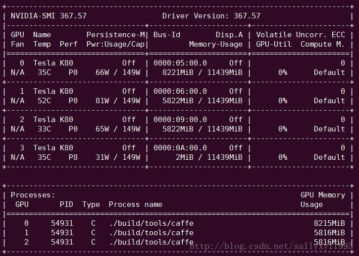

# linux

[TOC]

## Install

### system

系统安装需要注意ubuntu的版本。同样是14.04，但是可能不一样。所以目前暂时用硬盘中的那个。

安装的时候选择erase所有的东西，清爽安装。

安装之后需要安装显卡驱动。目前按照cuda8.0的方式安装。在安装cuda8.0的时候就可以选择安装显卡驱动的类型。

装完之后会遇到tty进入不了的情况，请参考：https://blog.csdn.net/chichoxian/article/details/60138909

### typora

如果源不好，直接用deb安装。去直接百度搜索deb文件。

see here: https://www.typora.io/#linux

### youdao

see here: http://blog.csdn.net/qianggezhishen/article/details/49208689

### fuxin

see here: http://blog.topspeedsnail.com/archives/8655

### sougou input

install:

Ubuntu 16.04 LTS安装sogou输入法详解: http://blog.csdn.net/qq_21792169/article/details/53152700

problem:

Ubuntu安装搜狗输入法找不到的问题:https://jingyan.baidu.com/article/54b6b9c0eedd252d583b4714.html

按照以上方式安装的话可能会找不到源，因此可以通过另外的方式添加源。

https://pinyin.sogou.com/linux/help.php

直接在应用商店中直接添加。

### zsh教程

- 安装zsh

    sudo apt-get install zsh
- 设置默认shell

如果想设置zsh为默认shell，执行

    chsh -s /bin/zsh #chsh:change shell

切换回bash为默认shell，执行

    chsh -s /bin/bash
- 安装oh-my-zsh

原版的zsh需要很麻烦的配置，而oh-my-zsh是第三方的一个配置方案，安装它就ok了

执行命令

    sh -c "$(wget https://raw.githubusercontent.com/robbyrussell/oh-my-zsh/master/tools/install.sh -O -)"
- 配置主题

主题非常多，选择一个合适的主题很重要。目前测试了一个非常简洁舒爽的主题，gnzh，通过修改~/.zshrc来进行配置

    ZSH_THEME="gnzh" 
- 进入和退出zsh模式

如果当前shell是bash，那么可以通过

    zsh

命令来进入zsh模式，如果想退出，执行

    exit

就可以退出zsh模式，进入bash模式

**Refs：**

Linux终极shell-Z Shell--用强大的zsh & oh-my-zsh把Bash换掉：http://blog.csdn.net/gatieme/article/details/52741221

## ubtuntu界面闪烁

自从在笔记本上装了ubuntu和nvidia驱动后，每次切换程序、切换窗口，尤其是浏览器的tab之间切换后，就会发生当前页面和之前页面之间的的快速切换式的闪烁。闪烁情况类似[这样（youtube）](http://youtu.be/p-iBqNlGhMI)

google后在一个外网论坛得到结果：https://bugs.launchpad.net/ubuntu/+source/nvidia-graphics-drivers-346/+bug/1314367

解决办法：安装compiz的一个包

~~~shell
sudo apt-get install compizconfig-settings-manager  
~~~

然后输入 ccsm命令进行设置，在高级搜索中找到工作区，并修改为下图的设置即可

参见：http://blog.csdn.net/songyu0120/article/details/44133009

## pygraphviz install 

1.首先安装graphviz, graphviz-dev
在ubuntu下面安装 graphviz
sudo apt-get install graphviz, graphviz-dev
2.直接用anaconda的pip去安装
Sudo pip install pygraphviz

## 显卡情况

~~~shell
nvidia-smi#静态显示
watch -n 10 nvidia-smi#每10s显示一次显卡信息
~~~

* 显示结果解释

  

  1.第一栏的Fan：N/A是风扇转速，从0到100%之间变动，这个速度是计算机期望的风扇转速，实际情况下如果风扇堵转，可能打不到显示的转速。有的设备不会返回转速，因为它不依赖风扇冷却而是通过其他外设保持低温（比如我们实验室的服务器是常年放在空调房间里的）。 
  2.第二栏的Temp：是温度，单位摄氏度。 
  3.第三栏的Perf：是性能状态，从P0到P12，P0表示最大性能，P12表示状态最小性能。 
  4.第四栏下方的Pwr：是能耗，上方的Persistence-M：是持续模式的状态，持续模式虽然耗能大，但是在新的GPU应用启动时，花费的时间更少，这里显示的是off的状态。 
  5.第五栏的Bus-Id是涉及GPU总线的东西，domain:bus:device.function 
  6.第六栏的Disp.A是Display Active，表示GPU的显示是否初始化。 
  7.第五第六栏下方的Memory Usage是显存使用率。 
  8.第七栏是浮动的GPU利用率。 
  9.第八栏上方是关于ECC的东西。
  10.第八栏下方Compute M是计算模式。 

  下面一张表示每个进程占用的显存使用率。**显存占用和GPU占用是两个不一样的东西**，显卡是由GPU和显存等组成的，显存和GPU的关系有点类似于内存和CPU的关系。我跑caffe代码的时候显存占得少，GPU占得多，师弟跑TensorFlow代码的时候，显存占得多，GPU占得少。

## 免密码登录

原理:客户端产生公私秘钥,将公钥添加到服务端的authorized_key中.客户端登录服务端的时候,会去自动匹配公钥和私钥,若匹配正确,就可以免密码登录.

执行:ssh-keygen 

产生公钥和私钥,分别为:id_rsa 和 id_rsa.pub

将公钥的内容复制到服务端的authorized_key中.

**authorized_keys的权限要是600!!!**

[root@B ~]# chmod 600 /root/.ssh/authorized_keys

**出错处理:**

現在的 ssh 使用同樣的方法會出現錯誤訊息

Agent admitted failure to sign using the key

解決方式 使用 ssh-add 指令将私钥 加进来 （根据个人的密匙命名不同更改 id_rsa）
\# ssh-add   ~/.ssh/id_rsa 

## zip文件乱码

安装unar就可以了。

~~~bash
sudo apt-get install unar
~~~

解压a.zip文件。

~~~bash
unar a.zip
~~~

## 安装ubuntu主题

首先安装unity-tweak-tool这个工具

~~~bash 
sudo apt-get install unity-tweak-tool
~~~

1. 安装**Flatabulous**主题

在～目录下创建文件夹`.themes`

进入这个文件夹，执行

~~~bash
git clone https://github.com/anmoljagetia/Flatabulous.git
~~~

打开unity-tweak-tool，选择theme这个选项，然后选择Flatabulous主题，就大功告成了！

参考：https://github.com/anmoljagetia/Flatabulous

2. 安装**Flat-Remix**

执行以下命令

~~~bash
sudo add-apt-repository ppa:daniruiz/flat-remix
sudo apt-get update
sudo apt-get install flat-remix
~~~

打开unity-tweak-tool，选择theme这个选项，然后选择**Flat-Remix**主题，就大功告成了！

参考：https://github.com/daniruiz/Flat-Remix

## 将源中的软件进行删除

参考：https://blog.csdn.net/qq_32897957/article/details/53023738