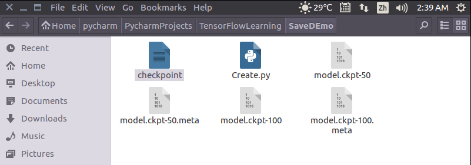
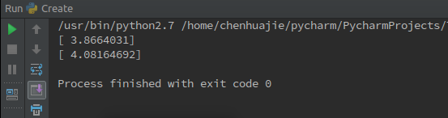

#  tensorflow笔记

[TOC]

## docker

1. 下载tensorflow镜像，并且创建自己的容器。

   ~~~shell
   # -it在命令行中运行，否则会在后台运行，不会在shell中显示。bash是指定了在bash运行，也可以在notebook上运行。
   nvidia-docker run --name yourc_tf -it tensorflow/tensorflow:latest-gpu bash
   # 注意nvidia-docker是gpu版本的。
   ~~~

2. 查看镜像和容器

   ~~~shell
   docker ps -a(包括没有启动的容器)
   docker images
   ~~~

3. 启动容器，关闭容器，删除容器

   ~~~shell
    # 是否需要用nvidia-docker?
    docker start -i yourc_tf(加上-i才能在shell上运行)
    docker stop 
    docker rm
   ~~~

4. 建立软链接

   ~~~shell
   ln -s source dist        # 建立软连接
   ~~~

5. 在docker中安装软件。

   在使用docker容器时，有时候里边没有安装vim，敲vim命令时提示说：vim: command not found，这个时候就需要安装vim，可是当你敲apt-get install vim命令时，提示：

   ```shell
   Reading package lists... Done
   Building dependency tree       
   Reading state information... Done
   E: Unable to locate package vim
   ```
    这时候需要敲：apt-get update，这个命令的作用是：同步 /etc/apt/sources.list 和 /etc/apt/sources.list.d 中列出的源的索引，这样才能获取到最新的软件包。等更新完毕以后再敲命令：apt-get install vim命令即可。

6. 将主机的目录挂载到容器内，实现数据共享。

   `Docker`可以支持把一个宿主机上的目录挂载到镜像里。
   命令如下:

   ~~~shell
   docker run -it -v /home/dock/Downloads:/usr/Downloads ubuntu64 /bin/bash
   ~~~

   通过-v参数，冒号前为宿主机目录，必须为绝对路径，冒号后为镜像内挂载的路径。

7. 拷贝数据

   但是对这三种方法我都不太喜欢，无意间看到另位一种方法供大家参考：

   从主机复制到容器`sudo docker cp host_path containerID:container_path`

   从容器复制到主机`sudo docker cp containerID:container_path host_path`

   容器ID的查询方法想必大家都清楚:`docker ps -a`

## flags

http://blog.csdn.net/lyc_yongcai/article/details/73456960

## 数据准备

tensorflow读取数据有三种方式：

- Feeding: Python code provides the data when running each step（提供数据文件的路径，在线读取）
- Reading from files: an input pipeline reads the data from files at the beginning of a TensorFlow graph（制作成tfrecoder）
- Preloaded data: a constant or variable in the TensorFlow graph holds all the data (for small data sets)(载入到内存中再进行读取)

### 1.直接读进内存

### 

### 2.TFRecord

http://blog.csdn.net/best_coder/article/details/70146441

TensorFlow高效读取数据之tfrecord详细解读:http://blog.csdn.net/qq_16949707/article/details/53483493

是否是list才要指定具体的长度？

Tensorflow中使用tfrecord方式读取数据：http://blog.csdn.net/u010358677/article/details/70544241

Tfrecords Guide：https://warmspringwinds.github.io/tensorflow/tf-slim/2016/12/21/tfrecords-guide/


- 另外一个系列：


TensorFlow 队列与多线程的应用：http://blog.csdn.net/chaipp0607/article/details/72924572 

TensorFlow TFRecord数据集的生成与显示：http://blog.csdn.net/chaipp0607/article/details/72960028

TensorFlow 组合训练数据（batching）：http://blog.csdn.net/chaipp0607/article/details/73016068

根据这个系列整理的代码

~~~python
# coding=utf-8
import os

import tensorflow as tf
from PIL import Image


def create_tfrecords_cls(data_dir, class_names, path_to_save_tfrecords):
    """
    Description:
        This func for classification
    Args:
        cwd: data folder, with multiple class folders
        classes: class names
        tfrecords_path_to_save: path to save tfrecords
    Return:
        None
    """
    writer = tf.python_io.TFRecordWriter(path_to_save_tfrecords)
    for index, name in enumerate(class_names):
        class_path = os.path.join(data_dir, name)
        for img_name in os.listdir(class_path):
            img_path = os.path.join(class_path, img_name)
            print 'img_name:', img_name
            img = Image.open(img_path)
            # convert img to binary file
            img_raw = img.tobytes()
            example = tf.train.Example(features=tf.train.Features(feature={
                "label": tf.train.Feature(int64_list=tf.train.Int64List(value=[index])),
                'img_raw': tf.train.Feature(bytes_list=tf.train.BytesList(value=[img_raw]))
            }))
            writer.write(example.SerializeToString())
    writer.close()
    return


def create_tfrecords_reg(data_dir, class_names, path_to_save_tfrecords):
    """
    Description:
        This func for regression
    Args:
        cwd: data folder, with multiple class folders
        classes: class names
        tfrecords_path_to_save: path to save tfrecords
    Return:
        None
    """
    # TODO
    writer = tf.python_io.TFRecordWriter(path_to_save_tfrecords)
    for index, name in enumerate(class_names):
        class_path = os.path.join(data_dir, name)
        for img_name in os.listdir(class_path):
            img_path = os.path.join(class_path, img_name)
            print 'img_name:', img_name
            img = Image.open(img_path)
            # convert img to binary file
            img_raw = img.tobytes()
            example = tf.train.Example(features=tf.train.Features(feature={
                "label": tf.train.Feature(int64_list=tf.train.Int64List(value=[index])),
                'img_raw': tf.train.Feature(bytes_list=tf.train.BytesList(value=[img_raw]))
            }))
            tf.train.Feature()
            writer.write(example.SerializeToString())
    writer.close()
    return


def decode(tfrecords_path, swd):
    filename_queue = tf.train.string_input_producer([tfrecords_path])  # 读入流中
    reader = tf.TFRecordReader()
    _, serialized_example = reader.read(filename_queue)  # 返回文件名和文件
    features = tf.parse_single_example(serialized_example,
                                       features={
                                           'label': tf.FixedLenFeature([], tf.int64),
                                           'img_raw': tf.FixedLenFeature([], tf.string),
                                       })  # 取出包含image和label的feature对象
    # tf.decode_raw可以将字符串解析成图像对应的像素数组
    image = tf.decode_raw(features['img_raw'], tf.uint8)
    image = tf.reshape(image, [200, 200, 3])
    label = tf.cast(features['label'], tf.int64)
    with tf.Session() as sess:  # 开始一个会话
        init_op = tf.global_variables_initializer()
        sess.run(init_op)
        # 启动多线程
        coord = tf.train.Coordinator()
        threads = tf.train.start_queue_runners(coord=coord)
        for i in range(40):
            example, l = sess.run([image, label])  # 在会话中取出image和label
            img = Image.fromarray(example, 'RGB')  # 这里Image是之前提到的
            img.save(swd + '/' + str(i) + '_''Label_' + str(l) + '.jpg')  # 存下图片
            print 'read_records:', l
            # print(example, l)
        coord.request_stop()
        coord.join(threads)


def get_nextbatch(swd, tfrecords_path, image_size):
    """
    Args:
        swd:
        tfrecords_path:
        image_size:
    Returns:

    """
    filename_queue = tf.train.string_input_producer([tfrecords_path])  # 读入流中
    reader = tf.TFRecordReader()
    _, serialized_example = reader.read(filename_queue)  # 返回文件名和文件
    features = tf.parse_single_example(serialized_example,
                                       features={
                                           'label': tf.FixedLenFeature([], tf.int64),
                                           'img_raw': tf.FixedLenFeature([], tf.string),
                                       })  # 取出包含image和label的feature对象
    image = tf.decode_raw(features['img_raw'], tf.uint8)
    image = tf.reshape(image, image_size)
    label = tf.cast(features['label'], tf.int64)

    # 组合batch
    batch_size = 4
    mini_after_dequeue = 100
    capacity = mini_after_dequeue + 3 * batch_size

    example_batch, label_batch = tf.train.batch([image, label], batch_size=batch_size, capacity=capacity)

    with tf.Session() as sess:  # 开始一个会话
        init_op = tf.initialize_all_variables()
        sess.run(init_op)
        coord = tf.train.Coordinator()
        threads = tf.train.start_queue_runners(sess=sess, coord=coord)
        for i in range(10):  # 10个batch
            example, l = sess.run([example_batch, label_batch])  # 取出一个batch
            for j in range(batch_size):  # 每个batch内4张图
                sigle_image = Image.fromarray(example[j], 'RGB')
                sigle_label = l[j]
                print (swd + '/batch_' + str(i) + '_' + 'size' + str(j) + '_' + 'Label_' + str(sigle_label) + '.jpg')
                sigle_image.save(swd + '/batch_' + str(i) + '_' + 'size' + str(j) + '_' + 'Label_' + str(
                    sigle_label) + '.jpg')  # 存下图片
                # print(example, l)
        coord.request_stop()
        coord.join(threads)


if __name__ == '__main__':
    # data path
    cwd = './data'
    # classes
    classes = {'forky': 1, 'knifey': 2}
    tfrecords_path_to_save = '/home/pi/stone/Notes/tensorflow/TFRecords/tfrecords/mydata.tfrecords'
    create_records(cwd=cwd, classes=classes, tfrecords_path_to_save=tfrecords_path_to_save)
    swd = '/home/pi/stone/Notes/tensorflow/TFRecords/img2'
    # decode(tfrecords_path=tfrecords_path_to_save, swd=swd)
    get_nextbatch(swd=swd, tfrecords_path=tfrecords_path_to_save)
~~~

## Saver类

### Saver的背景介绍

我们经常在训练完一个模型之后希望保存训练的结果，这些结果指的是模型的参数，以便下次迭代的训练或者用作测试。Tensorflow针对这一需求提供了Saver类。Saver类提供了向checkpoints文件保存和从checkpoints文件中恢复变量的相关方法。Checkpoints文件是一个二进制文件，它把变量名映射到对应的tensor值 。只要提供一个计数器，当计数器触发时，Saver类可以自动的生成checkpoint文件。这让我们可以在训练过程中保存多个中间结果。例如，我们可以保存每一步训练的结果。为了避免填满整个磁盘，Saver可以自动的管理Checkpoints文件。例如，我们可以指定保存最近的N个Checkpoints文件。

### Saver的实例

下面以一个例子来讲述如何使用Saver类

~~~python
import tensorflow as tf  
import numpy as np  
  
x = tf.placeholder(tf.float32, shape=[None, 1])  
y = 4 * x + 4  
  
w = tf.Variable(tf.random_normal([1], -1, 1))  
b = tf.Variable(tf.zeros([1]))  
y_predict = w * x + b  
  
loss = tf.reduce_mean(tf.square(y - y_predict))  
optimizer = tf.train.GradientDescentOptimizer(0.5)  
train = optimizer.minimize(loss)  
  
isTrain = False  
train_steps = 100  
checkpoint_steps = 50  
checkpoint_dir = ''  
  
saver = tf.train.Saver()  # defaults to saving all variables - in this case w and b  
x_data = np.reshape(np.random.rand(10).astype(np.float32), (10, 1))  
  
with tf.Session() as sess:  
    sess.run(tf.initialize_all_variables())  
    if isTrain:  
        for i in xrange(train_steps):  
            sess.run(train, feed_dict={x: x_data})  
            if (i + 1) % checkpoint_steps == 0:  
                saver.save(sess, checkpoint_dir + 'model.ckpt', global_step=i+1)  
    else:  
        ckpt = tf.train.get_checkpoint_state(checkpoint_dir)  
        if ckpt and ckpt.model_checkpoint_path:  
            saver.restore(sess, ckpt.model_checkpoint_path)  
        else:  
            pass  
        print(sess.run(w))  
        print(sess.run(b))  
~~~


- isTrain：用来区分训练阶段和测试阶段，True表示训练，False表示测试

- train_steps：表示训练的次数，例子中使用100
- checkpoint_steps：表示训练多少次保存一下checkpoints，例子中使用50
- checkpoint_dir：表示checkpoints文件的保存路径，例子中使用当前路径

### 训练阶段

使用Saver.save()方法保存模型：

- sess：表示当前会话，当前会话记录了当前的变量值
- checkpoint_dir + 'model.ckpt'：表示存储的文件名
- global_step：表示当前是第几步

训练完成后，当前目录底下会多出5个文件。



打开名为“checkpoint”的文件，可以看到保存记录，和最新的模型存储位置


### 测试阶段

测试阶段使用saver.restore()方法恢复变量：

1. sess：表示当前会话，之前保存的结果将被加载入这个会话
2. ckpt.model_checkpoint_path：表示模型存储的位置，不需要提供模型的名字，它会去查看checkpoint文件，看看最新的是谁，叫做什么。

运行结果如下图所示，加载了之前训练的参数w和b的结果




### 恢复部分模型

参考：https://stackoverflow.com/questions/42217320/restore-variables-that-are-a-subset-of-new-model-in-tensorflow


##  tf.train.batch和tf.train.shuffle_batch的理解

tf.train.batch和tf.train.shuffle_batch的理解：http://blog.csdn.net/ying86615791/article/details/73864381

How tf.train.shuffle_batch works：https://stackoverflow.com/questions/45203872/how-tf-train-shuffle-batch-works

What's going on in tf.train.shuffle_batch and `tf.train.batch?：https://stackoverflow.com/questions/43028683/whats-going-on-in-tf-train-shuffle-batch-and-tf-train-batch

## deconvolution

反卷积请看:http://blog.csdn.net/mao_xiao_feng/article/details/71713358

反卷积是需要指定out_shape的,因为需要通过same和valid来指定.

https://github.com/vdumoulin/conv_arithmetic

## conv Valid 和Same

参考博客：[http://www.cnblogs.com/willnote/p/6746668.html](http://www.cnblogs.com/willnote/p/6746668.html)

### 图示说明


- 用一个3x3的网格在一个28x28的图像上做切片并移动
- 移动到边缘上的时候，如果不超出边缘，3x3的中心就到不了边界
- 因此得到的内容就会缺乏边界的一圈像素点，只能得到26x26的结果
- 而可以越过边界的情况下，就可以让3x3的中心到达边界的像素点
- 超出部分的矩阵补零

### 代码说明

根据tensorflow中的conv2d函数，我们先定义几个基本符号

- 输入矩阵 W×W，这里只考虑输入宽高相等的情况，如果不相等，推导方法一样，不多解释。
- filter矩阵 F×F，卷积核
- stride值 S，步长
- 输出宽高为 new_height、new_width

在Tensorflow中对padding定义了两种取值：VALID、SAME。下面分别就这两种定义进行解释说明。

### VALID

```
new_height = new_width = (W – F + 1) / S  #结果向上取整
```

- 含义：new_height为输出矩阵的高度
- 说明：VALID方式不会在原有输入矩阵的基础上添加新的值，输出矩阵的大小直接按照公式计算即可

### SAME

```
new_height = new_width = W / S    #结果向上取整
```

- 含义：new_height为输出矩阵的高度
- 说明：对W/S的结果向上取整得到W"包含"多少个S

```
pad_needed_height = (new_height – 1)  × S + F - W
```

- 含义：pad_needed_height为输入矩阵需要补充的高度
- 说明：因为new_height是向上取整的结果，所以先-1得到W可以完全包裹住S的块数，之后乘以S得到这些块数的像素点总和，再加上filer的F并减去W，即得到在高度上需要对W补充多少个像素点才能满足new_height的需求

```
pad_top = pad_needed_height / 2    #结果取整
```

- 含义：pad_top为输入矩阵上方需要添加的高度
- 说明：将上一步得到的pad_needed_height除以2作为矩阵上方需要扩充0的像素点数

```
pad_bottom = pad_needed_height - pad_top
```

- 含义：pad_bottom为输入矩阵下方需要添加的高度
- 说明：pad_needed_height减去pad_top的剩余部分补充到矩阵下方

以此类推，在宽度上需要pad的像素数和左右分别添加的像素数为

```
pad_needed_width = (new_width – 1)  × S + F - W
pad_left = pad_needed_width  / 2    #结果取整
pad_right = pad_needed_width – pad_left
```


## tensorboard

1.网络可视化

通过name_scope或者variable_scope将一些数据包起来，作为一个模块来显示。

命令其实很简单，只需要两句

~~~python
sess=tf.Session()
writer = tf.summary.FileWriter(log_dir="/home/mensaochun/mensaochun/graph", sess.graph)
~~~

通过log_dir指定event存放的位置，在运行python文件，再terminal中输入以下命令就可以进行可视化了。

~~~shell
tensorboard --log_dir="/home/mensaochun/mensaochun/graph"
~~~

2.查看数据

- 使用tf.summary.scalar记录标量

http://blog.csdn.net/sinat_33761963/article/details/62433234

## 远程可视化

远程可视化，需要在服务器和客户端都安装OpenSSH.

windows安装：在这里下载https://www.mls-software.com/opensshd.html

安装一路回车。通过在命令行中输入ssh查看是否安装好。

linux安装openssh-server

~~~shell
sudo apt-get install openssh-server
~~~

在客户端连接服务器的时候，输入

~~~shell
ssh -L 16006:127.0.0.1:6006 username@server_ip
~~~

然后在客户端的浏览器中输入

~~~python
http://127.0.0.1:16006/
~~~

就可以了。

## tf.Variable(), tf.get_variable()

参考这篇文章，可以说讲得非常详细了：http://blog.csdn.net/qq_22522663/article/details/78729029

有两种方式可以创建变量，一种是tf.variable()，另外一种是tf.get_variable()

前者不需要指定变量名字，系统会自动安排；后者则要手动指定名字。当在同一个variable_scope下存在

这时候问题就来了，若在函数中通过tf.get_variable()定义了一个variable，当多次调用该函数的时候就出现问题，因为variable的名字就只有一个。而tf.variable()应该不存在这个问题，每次调用函数的时候，变量的名字都会重新命名。

但是，这样又有一个问题，变量怎么重用？

若是tf.variable()，好像没办法重复使用，但是tf.get_variable()通过定义tf.variable_scope()可以指定变量范围，比如model/weights,再指定重用就好了。

详细见官网，讲得很详细。https://www.tensorflow.org/programmers_guide/variables

## tf.name_scope, tf.variable_scope

几个注意的问题：

1.variable.name和variable.op.name有什么区别？

参考链接：https://stackoverflow.com/questions/34727792/whats-difference-between-variable-name-and-variable-op-name

2.name_scope和variable_scope的区别？

主要有两点：

- name_scope 一定影响op的名字，一定影响tf.variable，不影响tf.get_variable。


- variable_scope 影响tf.variable和tf.get_variable的名字，同时影响op的名字。

tf.get_variable()会忽略name_scope的作用，而tf.variable()则不会。看下面的例子：

~~~python
with tf.variable_scope("foo"):
    with tf.name_scope("bar"):
        v=tf.Variable(1.0,name='v')
        x = 1.0 + v
print v.name
print x.op.name

#输出的结果
foo/bar/v:0
foo/bar/add

with tf.variable_scope("foo"):
    with tf.name_scope("bar"):
        v = tf.get_variable("v", [1])
        # v=tf.Variable(1.0,name='v')
        x = 1.0 + v

print v.name
print x.op.name
#输出的结果
foo/v:0
foo/bar/add
~~~

3.关于变量重用

http://blog.csdn.net/qq_19918373/article/details/69499091


## padding中的valid和same

参考这篇文章：

http://blog.csdn.net/wuzqchom/article/details/74785643


##  tf.nn.sparse_softmax_cross_entropy_with_logits

http://blog.csdn.net/john_xyz/article/details/61211422


## tensorflow1.4安装出错

import tensorflow 出错libcudnn.so.6: cannot open shared object file: No such file or directory

解决方法：

https://hk.saowen.com/a/f567da5f37bab03970cad4dc11d366036779269a0cf6510868797623c5ac3845

cudnn下载：

https://developer.nvidia.com/rdp/cudnn-download

选择：Download cuDNN v6.0 (April 27, 2017), for CUDA 8.0→cuDNN v6.0 Library for Linux

**Note**:是否与caffe发生冲突？

## 设置GPU设备

**在Python代码中指定GPU**

~~~python
import os
os.environ["CUDA_VISIBLE_DEVICES"] = "0"
~~~

如果有多块GPU,直接设置

~~~python
import os
os.environ["CUDA_VISIBLE_DEVICES"] = "0,1"
~~~

参考文章:http://blog.csdn.net/guvcolie/article/details/77164230

## 自适应学习率

在模型的初期的时候，往往设置为较大的学习速率比较好，因为距离极值点比较远，较大的学习速率可以快速靠近极值点；而，后期，由于已经靠近极值点，模型快收敛了，此时，采用较小的学习速率较好，较大的学习速率，容易导致在真实极值点附近来回波动，就是无法抵达极值点。

在tensorflow中，提供了一个较为友好的API,

~~~python
tf.train.exponential_decay(learning_rate, global_step, decay_steps, decay_rate, staircase=False, name=None)
~~~

其数学表达式是这样的：

$$decayed\_learning\_rate = learning\_rate \times decay\_rate ^{ (global\_step / decay\_steps)}$$

先解释API中的参数的意思，第一个参数`learning_rate`即初始学习速率，第二个参数，是用来计算步骤的，每调用一次优化器，即自增1，第三个参数`decay_steps`通常设为一个常数，如数学公式中所示，与第五个参数配合使用效果较好，第五个参数`staircase`如果设置为`True`，那么指数部分就会采用整除策略，表示每`decay_step`，学习速率变为原来的`decay_rate`，至于第四个参数`decay_rate`表示的是学习速率的下降倍率。

```python
import tensorflow as tf

global_step = tf.Variable(0, trainable=False)
starter_learning_rate = 0.1
learning_rate = tf.train.exponential_decay(learning_rate=starter_learning_rate,
                                           global_step=global_step,
                                           decay_steps=1000,
                                           decay_rate=0.9,
                                           staircase=True)
# y=x**2+2x+1
x = tf.get_variable('x', shape=[1], initializer=tf.constant_initializer(value=2))
y = tf.square(x) + tf.multiply(2., x) + 1.
optimizer = tf.train.AdagradOptimizer(learning_rate=learning_rate).minimize(loss=y, global_step=global_step)

with tf.Session() as sess:
    sess.run(tf.global_variables_initializer())
    for i in range(10000):
        sess.run(optimizer)
        x_, y_, learning_rate_, global_step_ = sess.run([x, y, learning_rate, global_step])
        print 'iter', i, 'x', x_, "y:", y_, "learning_rate:", learning_rate_, 'global step:', global_step_
```

意思就是，初始的学习速率是0.1，每经过1000次训练后，学习速率变为原来的0.9

参考文章: https://www.cnblogs.com/crackpotisback/p/7105748.html


## Dropout

dropout在训练的时候设置为(0,1)之间的数字,但是一般在测试阶段,是不进行dropout的,因此设置为0?因此,最好将dropout设置为一个placeholder,作为可变的网络输入.可以这么做:

~~~python
keep_probability = tf.placeholder(tf.float32, name="keep_probabilty")
~~~


## Debug

ref：

官网：https://www.tensorflow.org/programmers_guide/debugger

民间：https://www.jianshu.com/p/9fd237c7fda3


## 出错

1.error when import tensorflow:ImportError: libcudnn.so.5: cannot open shared object file: No such file or directory

Had the same problem it was solved by :

~~~shell
sudo ldconfig /usr/local/cuda/lib64
~~~

ref：https://github.com/tensorflow/tensorflow/issues/7522